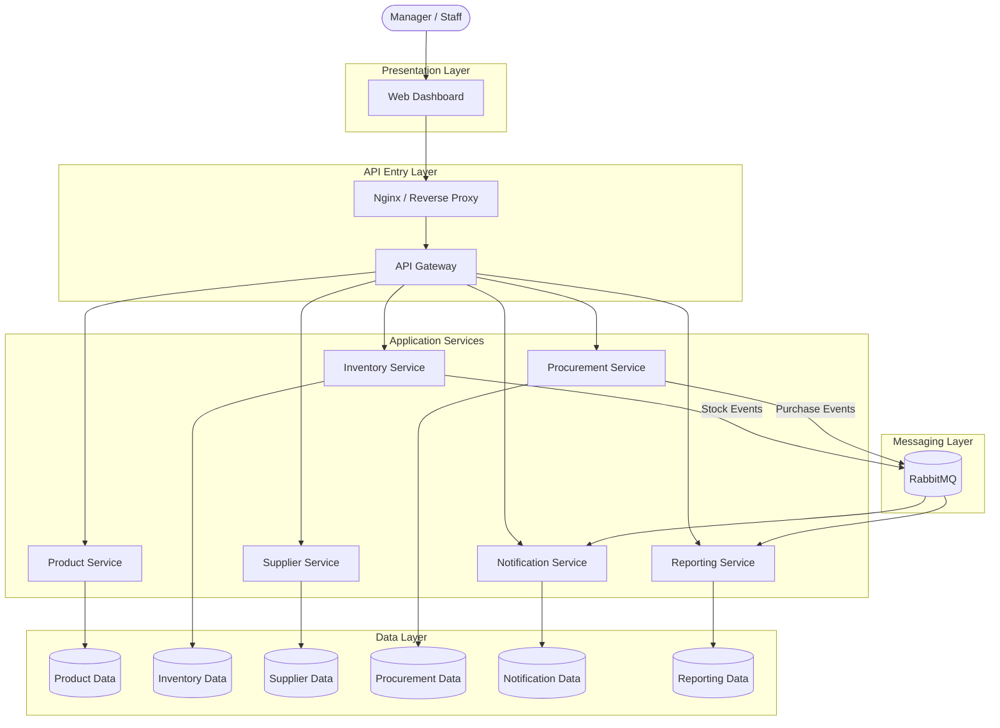

# System Architecture

## Architecture Diagram

```mermaid
flowchart TB
    User([Manager / Staff])

    subgraph Client["Presentation Layer"]
        Web["Web Dashboard"]
    end

    subgraph Entry["API Entry Layer"]
        Nginx["Nginx / Reverse Proxy"]
        Gateway["API Gateway"]
    end

    subgraph Services["Application Services"]
        Product["Product Service"]
        Inventory["Inventory Service"]
        Supplier["Supplier Service"]
        Procurement["Procurement Service"]
        Notification["Notification Service"]
        Reporting["Reporting Service"]
    end

    subgraph Messaging["Messaging Layer"]
        RabbitMQ[("RabbitMQ")]
    end

    subgraph Data["Data Layer"]
        ProductDB[("Product Data")]
        InventoryDB[("Inventory Data")]
        SupplierDB[("Supplier Data")]
        ProcurementDB[("Procurement Data")]
        NotificationDB[("Notification Data")]
        ReportingDB[("Reporting Data")]
    end

    User --> Web
    Web --> Nginx
    Nginx --> Gateway

    Gateway --> Product
    Gateway --> Inventory
    Gateway --> Supplier
    Gateway --> Procurement
    Gateway --> Notification
    Gateway --> Reporting

    Product --> ProductDB
    Inventory --> InventoryDB
    Supplier --> SupplierDB
    Procurement --> ProcurementDB
    Notification --> NotificationDB
    Reporting --> ReportingDB

    Inventory -->|Stock Events| RabbitMQ
    Procurement -->|Purchase Events| RabbitMQ
    RabbitMQ --> Notification
    RabbitMQ --> Reporting
```
